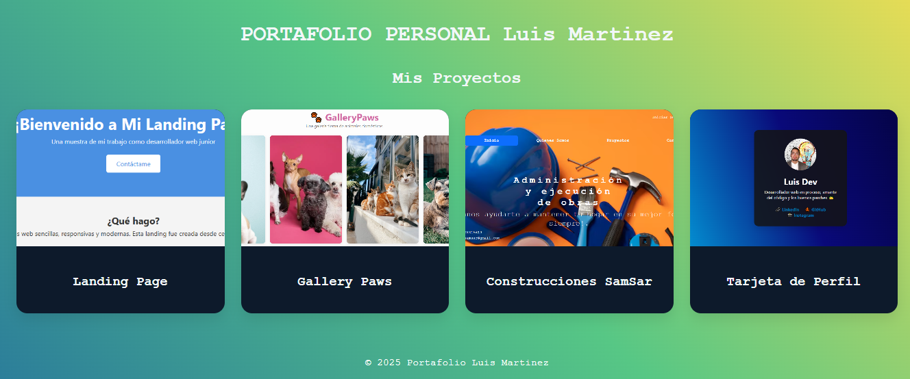

🧠 Portafolio Web - Luis F. Martinez

Este es mi portafolio web personal, creado como parte de mi proceso de aprendizaje y crecimiento como desarrollador frontend. Aquí muestro algunos de mis proyectos más recientes, construidos con **HTML**, **CSS**, y mucho amor por el código.

---

## 🚀 ¿Qué encontrarás en este portafolio?

Una galería estilo **grid responsive** que muestra mis proyectos actuales, cada uno con:
- Un **título atractivo**
- Una **imagen de vista previa**
- Y un **enlace directo al proyecto en vivo**

Diseñado con **Flexbox**, **CSS Grid** y adaptado para que se vea bien tanto en móvil como en escritorio 💻📱

---

## 🛠️ Tecnologías utilizadas

- HTML5
- CSS3
- Flexbox
- Grid Layout
- Media Queries
- (Pronto) JavaScript

---

## 🖼️ Vista previa

---
## 🧪 Proyectos incluidos

| Proyecto               | URL en Vivo                                                                 |
|------------------------|------------------------------------------------------------------------------|
| 🐾 Gallery Paws        | [Ver sitio](https://lufemani02.github.io/GalleyPaws/)                        |
| 🧭 Landing Page        | [Ver sitio](https://lufemani02.github.io/LandingPage/)                       |
| 🏗️ Construcciones SamSar | [Ver sitio](https://lufemani02.github.io/SitioWeb/)                         |
| 📇 Tarjeta de Perfil | [Ver sitio](https://lufemani02.github.io/TarjetaPerfil/)  

---

## 💡 Lecciones aprendidas

- Uso combinado de **Flexbox y Grid** para maquetación profesional
- Manejo de **responsividad** con media queries
- Buenas prácticas en organización de archivos y estilos
- Diseño visual enfocado en la experiencia de usuario

---

## 🔗 Enlace al portafolio

👉 [Ver Portafolio en vivo](https://lufemani02.github.io/Portafolio)

---

## 👨‍💻 Autor

Hecho con pasión por **Luis F. Martinez**  
[LinkedIn](https://www.linkedin.com/in/luis-martinez-b7533b27b) | [GitHub](https://github.com/Lufemani02/)
